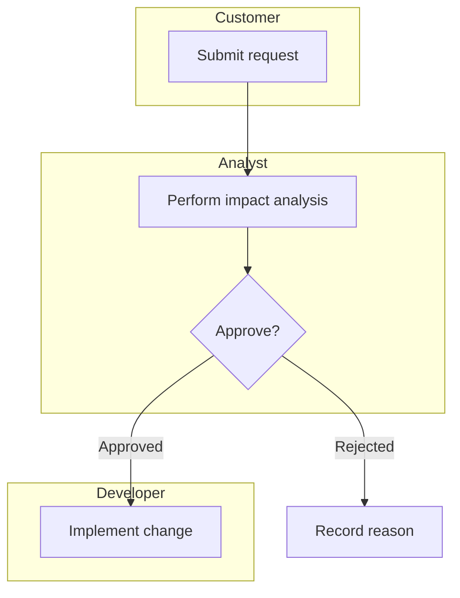

# UML Activity Diagram Template

Ìlànà emits activity diagrams as Mermaid `flowchart` blocks, because they render in
GitHub, most editors, and Artifacts, and they diff cleanly in version control.

## Notation mapping

| UML element | Mermaid form |
| --- | --- |
| Start node (filled circle) | `START((" "))` styled black |
| Action node (rounded rectangle) | `A["Do the thing"]` |
| Control flow (arrow) | `A --> B` |
| Decision (diamond, conditions labelled) | `D{"PIN correct?"}` with `D -->|Yes| X` |
| Merge (diamond, one flow onward) | `M{" "}` |
| Fork (bar, splits into concurrent) | `F[" "]` styled as a thin bar |
| Join (bar, recombines) | `J[" "]` styled as a thin bar |
| Note | `N[/"note text"/]` linked with `-.-` |
| Final flow node | `END(((" ")))` |

## Worked example: ATM withdrawal

```mermaid
flowchart TD
    START((" ")) --> A["Insert card"]
    A --> B["Enter PIN"]
    B --> D{"PIN correct?"}
    D -->|No| R["Retry"]
    R --> B
    D -->|Yes| C["Select amount"]
    C --> E{"Sufficient balance?"}
    E -->|No| F["Show insufficient funds"]
    F --> END(((" ")))
    E -->|Yes| G["Dispense cash"]
    G --> H["Print receipt"]
    H --> END

    style START fill:#000,stroke:#000
    style END fill:#fff,stroke:#000,stroke-width:3px
```

## Worked example with fork and join: order fulfilment

```mermaid
flowchart TD
    START((" ")) --> A["Receive order"]
    A --> V{"Payment authorised?"}
    V -->|No| X["Notify customer"] --> END(((" ")))
    V -->|Yes| FORK[" "]
    FORK --> B["Reserve stock"]
    FORK --> C["Send confirmation email"]
    B --> JOIN[" "]
    C --> JOIN
    JOIN --> D["Pick and pack"]
    D --> E["Dispatch"]
    E --> END

    style START fill:#000,stroke:#000
    style FORK fill:#000,stroke:#000,height:4px
    style JOIN fill:#000,stroke:#000,height:4px
    style END fill:#fff,stroke:#000,stroke-width:3px
```

Fork and join are used because "reserve stock" and "send confirmation" genuinely run
concurrently. Drawing them sequentially would misrepresent the process, and drawing them side by
side without a fork would leave the reader guessing.

## Swimlanes

Activity diagrams have limited swimlane support. Mermaid subgraphs approximate them:

If the process genuinely crosses many roles and systems, BPMN is the better notation. Its
swimlane support is extensive; the activity diagram's is limited.

## Rules

1. **Every decision has labelled conditions.** An unlabelled diamond is incomplete notation.
2. **Concurrency uses fork and join.** Never imply it by layout.
3. **One start node.** Multiple final flow nodes are fine and often clearer.
4. **Keep it to one screen.** Decompose into sub-processes rather than growing the diagram.
5. **Model reality.** If the real process has an undocumented approval step that everyone does,
   the diagram includes it.
