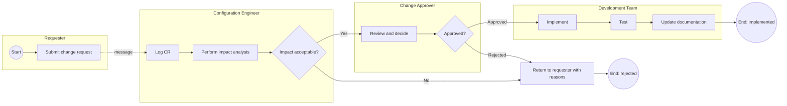

# BPMN Model Template

Use BPMN when the process crosses roles, departments or systems, when business users must read
it, or when it will drive automation. Use a UML activity diagram for flow inside one program.

## Core elements

| Element | Meaning |
| --- | --- |
| Pool | a participant: an organisation or a whole system |
| Lane | a role or department inside a pool |
| Start event (thin circle) | what triggers the process |
| Task (rounded rectangle) | a unit of work |
| Gateway (diamond) | branching: exclusive, parallel, inclusive, event-based |
| Sequence flow (solid arrow) | order of work within a pool |
| Message flow (dashed arrow) | communication between pools |
| Intermediate event | something that happens during the process (timer, message, error) |
| End event (thick circle) | how the process finishes |
| Data object | information consumed or produced |

## Gateway selection

| Gateway | Symbol | Semantics |
| --- | --- | --- |
| Exclusive (XOR) | diamond with X | exactly one path is taken |
| Parallel (AND) | diamond with + | all paths taken concurrently |
| Inclusive (OR) | diamond with O | one or more paths taken |
| Event-based | diamond with pentagon | the path is chosen by whichever event occurs first |

The most common modelling error is using an exclusive gateway where the process actually allows
several paths at once.

## Template: change request process

## Documentation that must accompany every BPMN model

A diagram alone is not a process definition. Each model carries:

| Field | Content |
| --- | --- |
| Process name | |
| Trigger | what starts it |
| Participants | pools and lanes, with real role names |
| Inputs | |
| Outputs | |
| Business rules | the conditions behind each gateway, stated precisely |
| Exceptions | what happens when the normal flow cannot complete |
| Service level | expected duration, and the escalation when it is exceeded |
| Systems touched | |
| Owner | who may change this process |

## Rules

1. **Message flow crosses pools; sequence flow does not.** Getting this wrong is the most common
   BPMN error.
2. **Every gateway condition is written down**, in the accompanying table if not on the diagram.
3. **Every path ends.** A path with no end event is an incomplete model.
4. **Model exceptions**, not only the happy path. In business processes, the exception path is
   usually where the cost lives.
5. **Name tasks as verb plus object.** "Perform impact analysis", not "Impact analysis".
